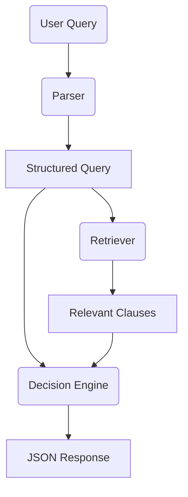

# HackRx 6.0 – LLM Document Processing System

An end-to-end, well-documented Python project that demonstrates how to build an **LLM-powered query–retrieval and decision engine** over large, unstructured documents (PDFs, Word, e-mails).

## Features

1. **Multi-format ingestion** – loaders for PDF, DOCX, and E-mail files extract text + metadata.
2. **Semantic vector store** – documents are chunked, embedded via `sentence-transformers`, and indexed with FAISS for fast nearest-neighbour search.
3. **Natural-language query parser** – rule-based + LLM fallback extracts structured fields (age, procedure, location, policy age, …).
4. **Decision engine** – pluggable logic evaluates retrieved clauses and returns JSON containing:
   ```json
   {
     "decision": "approved | rejected",
     "amount": 12345.67,
     "justification": "Text explanation …",
     "clauses": [ {"id": "…", "text": "…"} ]
   }
   ```
5. **CLI** – `python -m hackrx_llm --docs /path/to/folder --ask "46M knee surgery Pune 3-month policy"`.
6. **Extensible** – swap embeddings, LLM provider, or decision logic.
7. **Test-driven** – `pytest` covers parsing and retrieval.

## Quick-start

```bash
python -m venv .venv && source .venv/bin/activate  # Windows: .venv\Scripts\activate
pip install -r requirements.txt

# Build vector store (runs ingestion automatically)
python -m hackrx_llm ingest --docs sample_docs

# Ask a question
python -m hackrx_llm ask --query "46-year-old male, knee surgery in Pune, 3-month policy" --top_k 5
```

If an **OpenAI** key is present (`export OPENAI_API_KEY=…`), the parser will enrich/validate fields via GPT automatically; otherwise, rule-based extraction is used.

## Project Structure

```
├── hackrx_llm/          ← Library package
│   ├── ingestion/       ← PDF, Word, e-mail loaders
│   ├── parser.py        ← Query → structured data
│   ├── retriever.py     ← Vector store + semantic search
│   ├── decision_engine.py
│   ├── schema.py        ← Pydantic models
│   ├── cli.py           ← Typer CLI
│   └── __init__.py
├── tests/               ← Unit tests (pytest)
├── requirements.txt
└── README.md            ← You are here
```

## Design Diagram



## Contributing

1. Fork -> git clone -> create feature branch.
2. Ensure `pytest` passes & run `black` / `ruff`.
3. PR with clear description.

## License

MIT © 2025 Bajaj Finserv Health Ltd.
